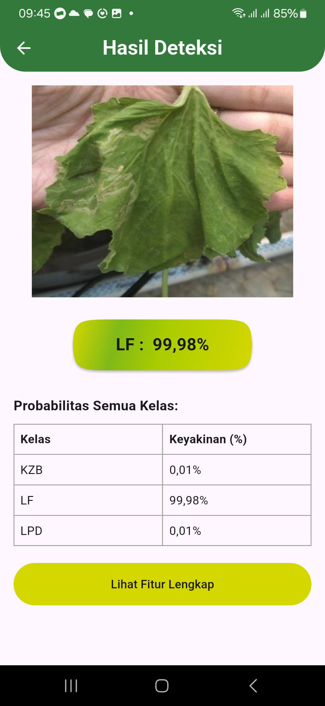
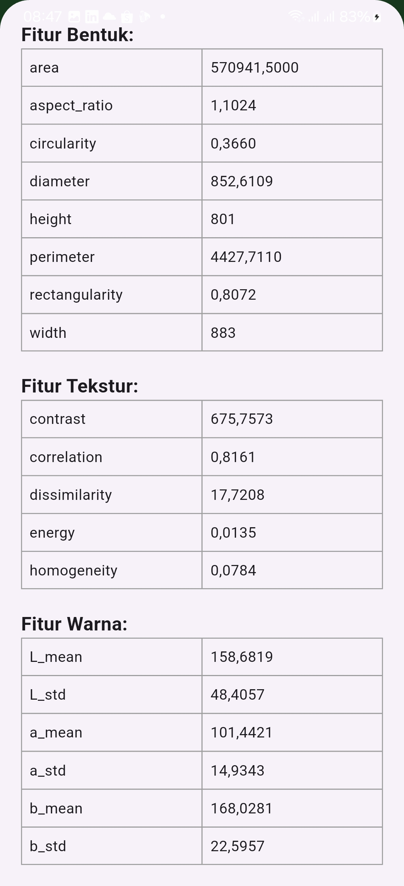

# Classification Disease Leaf Melon

Aplikasi ini berfungsi sebagai klasifikasi penyakit pada daun tanaman melon. Penyakit-penyakit yang diklasifikasi terdapat 3 (tiga) penyakit, yaitu Kekurangan Zat Besi (KZB), Lalat Pengerek Daun (LPD), dan Layu Fusarium (LF). Aplikasi ini disertai sebuah model yang dibangun dengan CNN. Aplikasi mengakses model secara online karena dilakukan deployment. Permasalahan dihadapi seperti kurangnya waktu pada para pekerja di bidang perkebunan melon saat dihadapi permasalahn penyakit, tidak ada sang pakar yang dapat dihubungi saat penanganan penyakit daun melon.

## 🚀 Fitur Utama
- Deteksi Penyakit Daun Melon
- Akses foto dari galeri
- Ambil gammbar dengan menggunakan kamera
- Hasil Ekstraksi Fitur pada gambar

## 📖 Dokumentasi

### Tampilan Aplikasi

#### Homme Screen

#### Home Screen (Show Delete & Detection Button)

#### Result Detection Screen

#### Result Extraction Features Section

